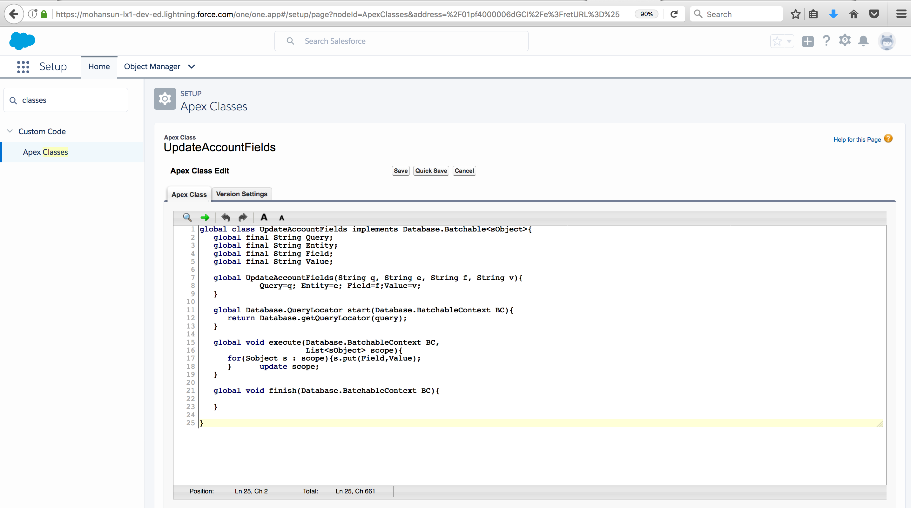
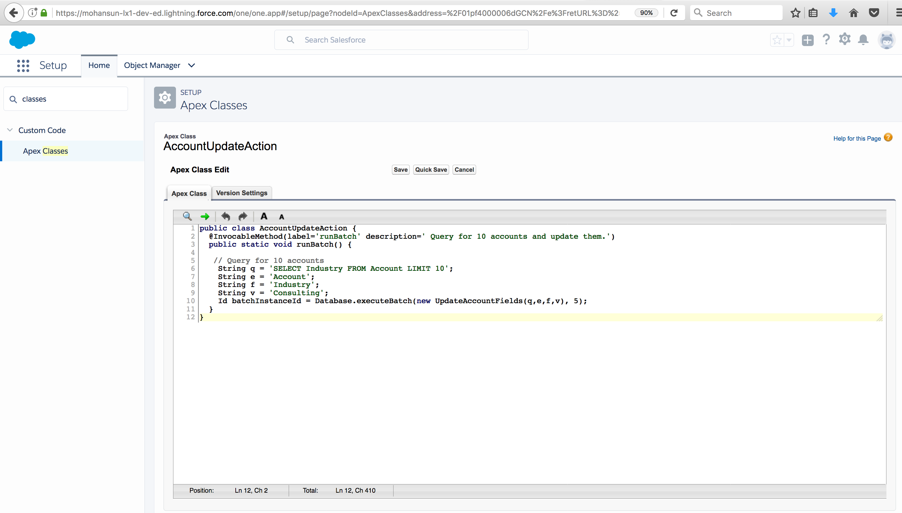
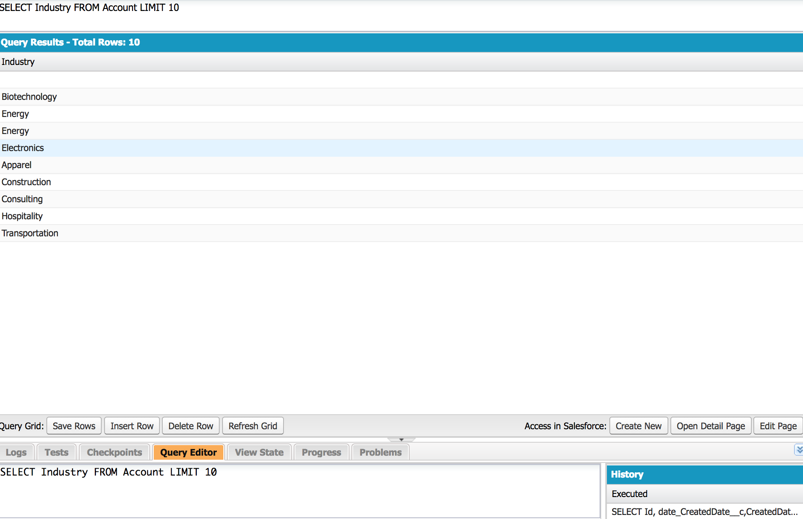
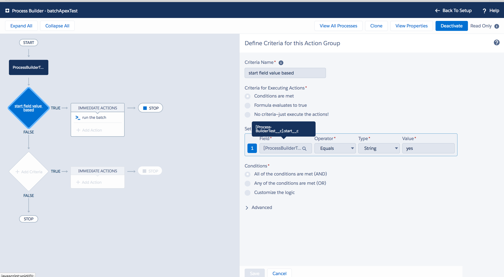
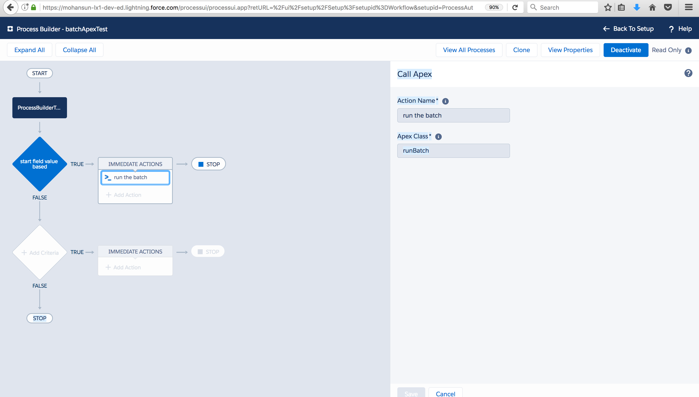
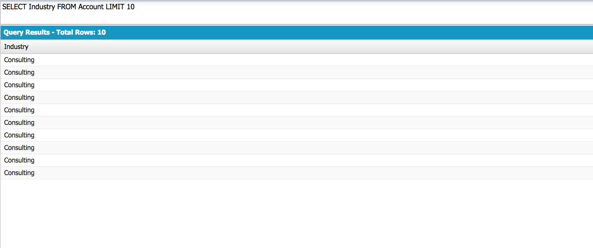

## Async Apex

[Ref](https://developer.salesforce.com/docs/atlas.en-us.apexcode.meta/apexcode/apex_batch_interface.htm)

Apex offers multiple ways for running your Apex code asynchronously.

 
Future Methods:

- When you have a long-running method and need to prevent delaying an Apex transaction
- When you make callouts to external Web services
- To segregate DML operations and bypass the mixed save DML error


Queueable Apex:

- To start a long-running operation and get an ID for it
- To pass complex types to a job
- To chain jobs

Batch Apex:

- For long-running jobs with large data volumes that need to be performed in batches, such as database maintenance jobs
- For jobs that need larger query results than regular transactions allow

Scheduled Apex:

- To schedule an Apex class to run on a specific schedule


#### Future Methods

Salesforce uses a queue-based framework to handle asynchronous processes from such sources as :
 1. future methods 
 2. batch Apex. 

 This queue is used to balance request workload across organizations. 

```java

// A future method runs in the background, asynchronously
//  Each future method is queued and executes when system resources become available. 

//  the execution of your code doesn’t have to wait for the completion of a long-running operation

// governor limits -- such as SOQL query limits and heap size limits are higher.

global class FutureClass {
    @future
    
    // Methods with the future annotation must be static methods, and can only return a void type
    
    /* -----------------------
    
    The specified parameters must be primitive data types, arrays of primitive data types, or collections of primitive data types.
    
     Methods with the future annotation cannot take sObjects or objects as arguments.
     
     Why this restriction on the method parameters:
     
     The reason why sObjects can’t be passed as arguments to future methods is because the sObject might change between the time you call the method and the time it executes.
     
     How can we work with sObjects:
     To work with sObjects that already exist in the database, pass the sObject ID instead (or collection of IDs) and use the ID to perform a query for the most up-to-date record. 
     
     
     
     
     -----------------------
    */
    public static void myFutureMethod() {   
    
         
         // Perform some operations
    }
}
```

Example: how to pass a list of  sObject IDs.

``` java


global class FutureMethodRecordProcessing {
    @future
    public static void processRecords(List<ID> recordIds){   
         // Get those records based on the IDs
         List<Account> accts = [SELECT Name FROM Account WHERE Id IN :recordIds];
         // Process records
    }
}

```

 The future method that makes a callout to an external service:
 
 ```java
 global class FutureMethodExample {
    @future(callout=true)
    public static void getStockQuotes(String acctName) {   
         // Perform a callout to an external service
    }

}
 ```

#### Best Practices:


Use the following best practices to ensure your organization is efficiently using the queue for your asynchronous processes.


1. Avoid adding large numbers of future methods to the asynchronous queue, if possible. If more than **2,000 unprocessed requests from a single organization are in the queue**, any additional requests from the same organization will be **delayed** while the queue handles requests from other organizations.

2. Ensure that future methods execute as fast as possible. To ensure fast execution of batch jobs, **minimize Web service callout times** and **tune queries* used in your future methods. The longer the future method executes, the more likely other queued requests are delayed when there are a large number of requests in the queue.
3. Test your future methods at scale. Where possible, test using an environment that generates the maximum number of future methods you’d expect to handle. This will help determine if delays will occur.
4. Consider using **batch Apex** instead of future methods to process **large numbers of records**.


### Batch Apex

The batch Apex can be use to build complex, long-running processes that run on **thousands of records**
 on the Force.com platform
 
 
 Batch Apex operates over small batches of records, covering your entire record set and breaking the processing down to manageable chunks.
 
 Example use cases:
 
  1. An archiving solution that runs on a **nightly basis**, looking for records past a certain date and adding them to an archive.
  2. A data cleansing operation that goes through all Accounts and Opportunities on a nightly basis and updates them if necessary, based on custom criteria.


How to develop:

Batch Apex is exposed as an **interface** (```Database.Batchable```) that must be **implemented** by the developer. 

3 methods to be implemented:

1. start: setting the context

``` java

//  Use Database.BatchableContext object to track the progress of the batch job
// Database.BatchableContext.getJobID() returns the ID of the AsyncApexJob object associated with this batch job as a string.

 global Database.QueryLocator | Iterable<sObject> start(Database.BatchableContext bc) {
 
 
 };

// iterable contains the records or objects passed to the job.

// When you’re using a simple query (SELECT) to generate the scope of objects in the batch job, use the Database.QueryLocator object

// If you use a QueryLocator object, the governor limit for the total number of records retrieved by SOQL queries is bypassed. For example, a batch Apex job for the Account object can return a QueryLocator for all account records (up to 50 million records) in an org. 

// Another example is a sharing recalculation for the Contact object that returns a QueryLocator for all account records in an org.


/////////
// Use the iterable to create a complex scope for the batch job. You can also use the iterable to create your own custom process for iterating through the list.

// If you use an iterable, the governor limit for the total number of records retrieved by SOQL queries is still enforced.

//If your code accesses external objects and is used in batch Apex, use Iterable<sObject> instead of Database.QueryLocator.


```


Code Example for start:

``` java


global class UpdateAccountFields implements Database.Batchable<sObject>{
   global final String Query;
   global final String Entity;
   global final String Field;
   global final String Value;

   global UpdateAccountFields(String q, String e, String f, String v){
             Query=q; Entity=e; Field=f;Value=v;
   }

   global Database.QueryLocator start(Database.BatchableContext BC){
      return Database.getQueryLocator(query);
   }

   global void execute(Database.BatchableContext BC, 
                       List<sObject> scope){
      for(Sobject s : scope){s.put(Field,Value); 
      }      update scope;
   }

   global void finish(Database.BatchableContext BC){

   }

}
```

```
// Query for 10 accounts
String q = 'SELECT Industry FROM Account LIMIT 10';
String e = 'Account';
String f = 'Industry';
String v = 'Consulting';
Id batchInstanceId = Database.executeBatch(new UpdateAccountFields(q,e,f,v), 5); 
```


2. execute:
```

// This method is called for each batch of records that you pass to it.
// performs  required processing for each chunk of data

// Batches of records tend to execute in the order in which they’re received from the start method.

// However, the order in which batches of records execute depends on various factors. The order of execution isn’t guaranteed.

// Each execution of a batch Apex job is considered a discrete transaction. 

//  For example, a batch Apex job that contains 1,000 records and is executed without the optional scope parameter from Database.executeBatch is considered five transactions of 200 records each. 

//  The Apex governor limits are reset for each transaction. If the first transaction succeeds but the second fails, the database updates made in the first transaction are not rolled back.


global void execute(Database.BatchableContext bc, list<P>){


}

```
3. finish:
```

// This method is called after all batches are processed.
// use the finish method to send confirmation emails or execute post-processing operations
global void finish(Database.BatchableContext bc){

}
```

Code Example for finish:

```java

global void finish(Database.BatchableContext BC){
   // Get the ID of the AsyncApexJob representing this batch job
   // from Database.BatchableContext.
   // Query the AsyncApexJob object to retrieve the current job's information.
   AsyncApexJob a = [SELECT Id, Status, NumberOfErrors, JobItemsProcessed,
      TotalJobItems, CreatedBy.Email
      FROM AsyncApexJob WHERE Id =
      :BC.getJobId()];
   // Send an email to the Apex job's submitter notifying of job completion.
   Messaging.SingleEmailMessage mail = new Messaging.SingleEmailMessage();
   String[] toAddresses = new String[] {a.CreatedBy.Email};
   mail.setToAddresses(toAddresses);
   mail.setSubject('Apex Sharing Recalculation ' + a.Status);
   mail.setPlainTextBody
   ('The batch Apex job processed ' + a.TotalJobItems +
   ' batches with '+ a.NumberOfErrors + ' failures.');
   Messaging.sendEmail(new Messaging.SingleEmailMessage[] { mail });
}
```


Batch jobs can be **programmatically invoked at runtime** using Apex


Limits:

You can only have **five queued or active batch jobs at one time**. You can evaluate your current count by viewing the Scheduled Jobs page in Salesforce or programmatically using SOAP API to query the ```AsyncApexJob``` object.


### Using Process Builder

Usecase:

Execute: UpdateAccountFields(...) Apex Batch when a record in ProcessBuilderTest.start is set to 'yes'

UpdateAccountField:



UpdateAccountAction:



Account Records Before Process Builder Process Execution:



Process Builder Process Criteria:




Process Builder Process Criteria:


Process Builder Process Criteria:




Account Records After Process Builder Process Execution:


 


  
  
  
  
  

